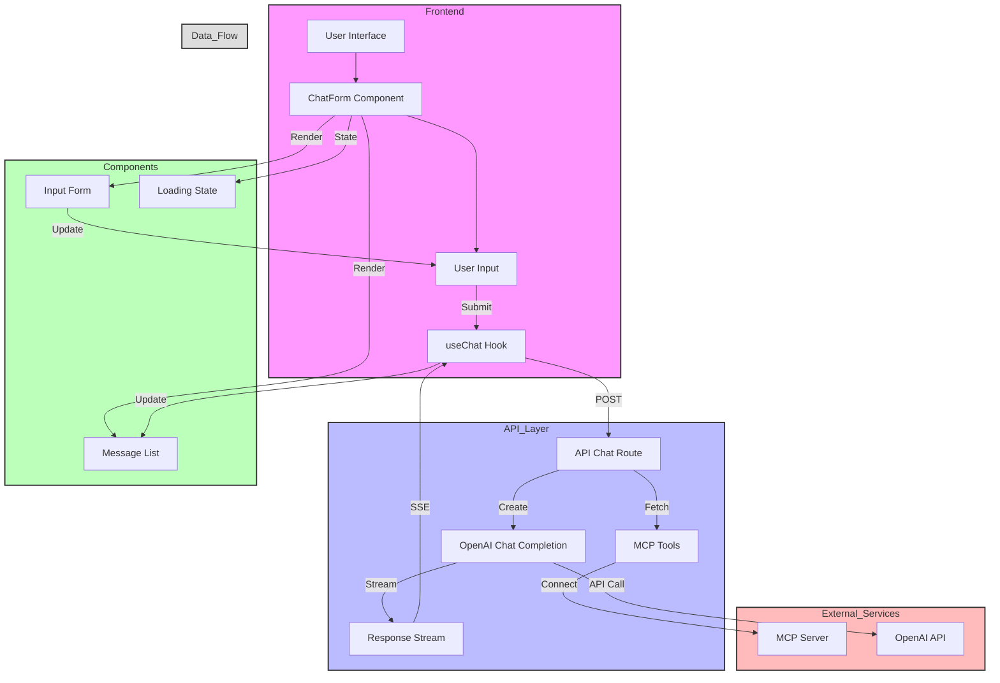

# Chat Interface Usage Guide

## Overview
This document describes how to use the MCP (Model Control Protocol) tools. There are two ways to interact with the tools:
1. Through the chat interface
2. Directly using the MCP SDK

## Architecture

The following diagram illustrates the application's architecture and data flow:



The diagram shows:
- Frontend components and user interaction flow
- API layer handling requests and tool integration
- External service connections (MCP Server and OpenAI)
- Real-time data flow using Server-Sent Events (SSE)

## Using the Chat Interface

### Starting the Application
1. Ensure your local MCP server is running on `http://localhost:3000`
2. Start the Next.js application:
   ```bash
   pnpm dev
   ```
3. Access the chat interface at `http://localhost:3001` (or whatever port is available)

### Listing Tools via Chat
To see what tools are available through the chat interface, use one of these commands:

```
List all available MCP tools
```
or
```
Show me the MCP tools you can access
```
or
```
What MCP tools do you have access to?
```

## Using the MCP SDK Directly

### List Tools Script
Create a file named `list-tools.js` with the following content:

```javascript
import { Client } from "@modelcontextprotocol/sdk/client/index.js";
import { SSEClientTransport } from "@modelcontextprotocol/sdk/client/sse.js";

const origin = process.argv[2] || "http://localhost:3000";

async function main() {
  const transport = new SSEClientTransport(new URL(`${origin}/sse`));

  const client = new Client(
    {
      name: "example-client",
      version: "1.0.0",
    },
    {
      capabilities: {
        prompts: {},
        resources: {},
        tools: {},
      },
    }
  );

  await client.connect(transport);

  console.log("Connected", client.getServerCapabilities());

  const result = await client.listTools();
  console.log(result);
}

main();
```

### Running the Script
1. Install the MCP SDK:
   ```bash
   pnpm add @modelcontextprotocol/sdk
   ```

2. Run the script:
   ```bash
   node list-tools.js
   ```

   Optionally specify a different server:
   ```bash
   node list-tools.js http://your-server:port
   ```

### Tool Response Format
The response will include:
- Tool name
- Description
- Required parameters
- Optional parameters
- Usage examples

## Environment Configuration
The application requires proper environment configuration to connect to the MCP server:

```env
# MCP Configuration
NEXT_PUBLIC_MCP_SERVER_URL=http://localhost:3000
```

## Troubleshooting

### Common Issues
1. If tools are not loading:
   - Verify MCP server is running on port 3000
   - Check browser console for connection errors
   - Ensure environment variables are set correctly
   - Verify the SSE endpoint is available at `/sse`

2. If responses are slow:
   - Check MCP server logs for any issues
   - Verify network connectivity
   - Check if the MCP server is responding to requests

### Debug Logs
The application includes detailed logging:
- Chat message sending/receiving
- MCP client connection status
- Tool fetching process
- Error details if something goes wrong

## Support
For additional support or to report issues:
1. Check the server logs for detailed error messages
2. Verify your MCP server configuration
3. Ensure all required dependencies are installed
4. Check the MCP SDK documentation for updates 